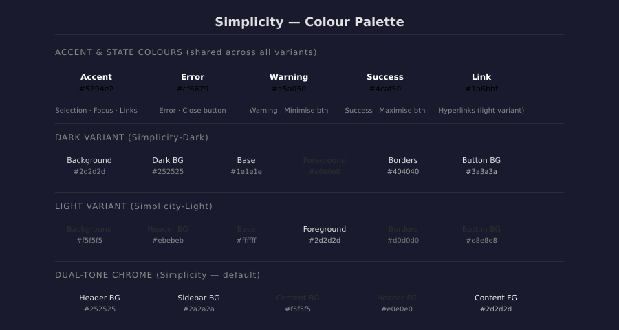

# Colour Palette

> 🌐 **Translate this page:**
> [🇪🇸 Español](https://translate.google.com/translate?sl=en&tl=es&u=https://github.com/PhantomNimbi/Simplicity/blob/main/wiki/Colour-Palette.md) ·
> [🇫🇷 Français](https://translate.google.com/translate?sl=en&tl=fr&u=https://github.com/PhantomNimbi/Simplicity/blob/main/wiki/Colour-Palette.md) ·
> [🇩🇪 Deutsch](https://translate.google.com/translate?sl=en&tl=de&u=https://github.com/PhantomNimbi/Simplicity/blob/main/wiki/Colour-Palette.md) ·
> [🇮🇹 Italiano](https://translate.google.com/translate?sl=en&tl=it&u=https://github.com/PhantomNimbi/Simplicity/blob/main/wiki/Colour-Palette.md) ·
> [🇧🇷 Português](https://translate.google.com/translate?sl=en&tl=pt&u=https://github.com/PhantomNimbi/Simplicity/blob/main/wiki/Colour-Palette.md) ·
> [🇷🇺 Русский](https://translate.google.com/translate?sl=en&tl=ru&u=https://github.com/PhantomNimbi/Simplicity/blob/main/wiki/Colour-Palette.md) ·
> [🇨🇳 中文](https://translate.google.com/translate?sl=en&tl=zh-CN&u=https://github.com/PhantomNimbi/Simplicity/blob/main/wiki/Colour-Palette.md) ·
> [🇯🇵 日本語](https://translate.google.com/translate?sl=en&tl=ja&u=https://github.com/PhantomNimbi/Simplicity/blob/main/wiki/Colour-Palette.md) ·
> [🇰🇷 한국어](https://translate.google.com/translate?sl=en&tl=ko&u=https://github.com/PhantomNimbi/Simplicity/blob/main/wiki/Colour-Palette.md) ·
> [🇸🇦 العربية](https://translate.google.com/translate?sl=en&tl=ar&u=https://github.com/PhantomNimbi/Simplicity/blob/main/wiki/Colour-Palette.md) ·
> [🇮🇳 हिन्दी](https://translate.google.com/translate?sl=en&tl=hi&u=https://github.com/PhantomNimbi/Simplicity/blob/main/wiki/Colour-Palette.md)

All colour variables are defined at the top of each GTK stylesheet as `@define-color` directives, making them easy to customise.



---

## Shared Accent & State Colours

These colours appear in every variant and remain constant across Dark, Light, and Dual-Tone.

| Role | Hex | Usage |
|------|-----|-------|
| Accent / selection | `#5294e2` | Selection highlight, focus rings, links (dark variant), progress bars, sliders, active toggles |
| Error / close button | `#cf6679` | Error state borders, error messages, window close button |
| Warning / minimise button | `#e5a050` | Warning notifications, window minimise button |
| Success / maximise button | `#4caf50` | Success messages, window maximise button |
| Link (light variant) | `#1a6bbf` | Hyperlinks in light and dual-tone content areas |
| Selected foreground | `#ffffff` | Text colour when a row or widget is selected with accent background |

---

## Dark Variant Palette (`simplicity-dark/`)

| CSS Variable | Hex | Role |
|-------------|-----|------|
| `bg_color` | `#2d2d2d` | Main window and widget backgrounds |
| `dark_bg` | `#252525` | Sidebars, header bars, panels |
| `darker_bg` | `#1a1a1a` | Deepest dark surfaces (e.g. menu shadows) |
| `base_color` | `#1e1e1e` | Text entry, list view, tree view backgrounds |
| `fg_color` / `text_color` | `#e0e0e0` | Primary text colour |
| `borders` | `#404040` | Widget and window frame borders |
| `button_bg` | `#3a3a3a` | Default button background |
| `button_hover_bg` | `#484848` | Button background on hover |
| `button_active_bg` | `#2a2a2a` | Button background when pressed |
| `header_bg` | `#252525` | Header bar background |
| `sidebar_bg` | `#2a2a2a` | Sidebar background |
| `selected_bg_color` | `#5294e2` | Selection / accent highlight |
| `tooltip_bg_color` | `#1c1c1c` | Tooltip background |
| `tooltip_fg_color` | `#e0e0e0` | Tooltip text |

---

## Light Variant Palette (`simplicity-light/`)

| CSS Variable | Hex | Role |
|-------------|-----|------|
| `bg_color` | `#f5f5f5` | Main window and widget backgrounds |
| `header_bg` | `#ebebeb` | Header bar and panel background |
| `sidebar_bg` | `#f0f0f0` | Sidebar background |
| `base_color` | `#ffffff` | Text entry, list view, tree view backgrounds |
| `fg_color` / `text_color` | `#2d2d2d` | Primary text colour |
| `borders` | `#d0d0d0` | Widget and window frame borders |
| `button_bg` | `#e8e8e8` | Default button background |
| `button_hover_bg` | `#d8d8d8` | Button background on hover |
| `button_active_bg` | `#c8c8c8` | Button background when pressed |
| `selected_bg_color` | `#5294e2` | Selection / accent highlight |
| `tooltip_bg_color` | `#f0f0f0` | Tooltip background |
| `tooltip_fg_color` | `#2d2d2d` | Tooltip text |

---

## Dual-Tone Palette (`simplicity-dualtone/`)

The dual-tone variant defines two distinct sets of variables — one for the dark chrome regions and one for the light content regions.

### Chrome (dark) variables
| CSS Variable | Hex | Used for |
|-------------|-----|---------|
| `header_bg` | `#252525` | Header bar background |
| `header_fg` | `#e0e0e0` | Header bar text |
| `sidebar_bg` | `#2a2a2a` | Sidebar / navigation panel background |
| `sidebar_fg` | `#e0e0e0` | Sidebar text |
| `chrome_borders` | `#404040` | Borders between chrome and content |
| `tooltip_bg_color` | `#1c1c1c` | Tooltip background |
| `tooltip_fg_color` | `#e0e0e0` | Tooltip text |

### Content (light) variables
| CSS Variable | Hex | Used for |
|-------------|-----|---------|
| `bg_color` | `#f5f5f5` | Main window body |
| `fg_color` / `text_color` | `#2d2d2d` | Primary text in content area |
| `base_color` | `#ffffff` | Text entries, tree views |
| `borders` | `#d0d0d0` | Widget borders inside content area |
| `button_bg` | `#e8e8e8` | Button background |
| `button_hover_bg` | `#d8d8d8` | Button hover |
| `button_active_bg` | `#c8c8c8` | Button pressed |

---

## GTK Dark-Mode Flag

The `gtk-application-prefer-dark-theme` setting in each variant's `gtk-3.0/settings.ini` controls whether GTK applications use their internal dark styling:

| Variant | Setting | Effect |
|---------|---------|--------|
| `Simplicity-Dark` | `gtk-application-prefer-dark-theme=1` | Applications render dark-mode widgets |
| `Simplicity` | `gtk-application-prefer-dark-theme=0` | Applications render light-mode widgets |
| `Simplicity-Light` | `gtk-application-prefer-dark-theme=0` | Applications render light-mode widgets |

---

## Customising the Palette

To change the accent colour across the whole theme, update the `selected_bg_color` variable in both `gtk-3.0/gtk.css` and `gtk-4.0/gtk.css`:

```css
/* Before */
@define-color selected_bg_color #5294e2;

/* After — teal accent example */
@define-color selected_bg_color #00b4b4;
```

For the GTK 2 theme, colours are written as literal hex values in `gtk-2.0/gtkrc`. Search for the old hex value and replace it with the new one.

For window manager themes, update the corresponding colour values in:
- `metacity-1/metacity-theme-3.xml` — look for `active_color` and button fill attributes
- `xfwm4/themerc` — `active_color_1`, `inactive_color_1`, and button colour keys
- `openbox-3/themerc` — `window.active.*` and `window.inactive.*` colour entries
