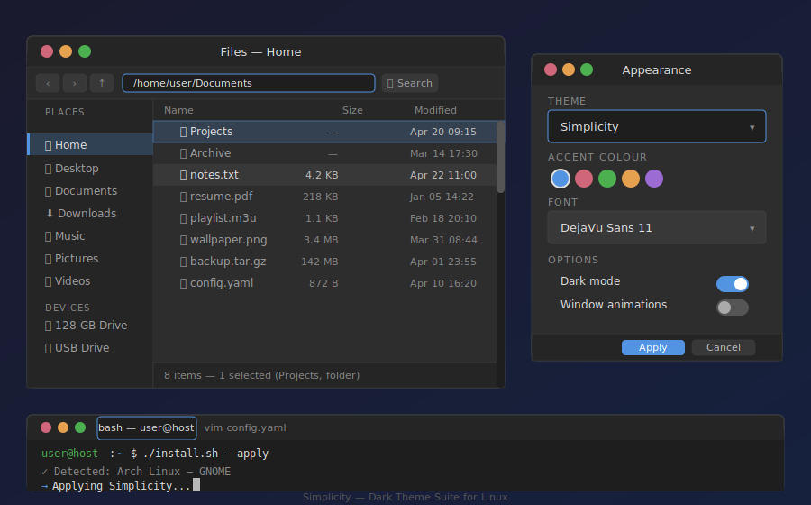

# Simplicity — Linux Desktop Theme Suite Wiki

Welcome to the official wiki for **Simplicity**, a clean, modern GTK theme suite for Linux desktop environments.



---

## Contents

| Page | Description |
|------|-------------|
| [Theme Variants](Theme-Variants) | Overview of all three theme variants with screenshots |
| [Theme Elements](Theme-Elements) | Breakdown of every UI component and how it's styled |
| [Colour Palette](Colour-Palette) | Complete colour reference for every variant |
| [Installation](Installation) | Step-by-step installation guide for every distro and DE |
| [Desktop Environments](Desktop-Environments) | Per-DE configuration and manual application instructions |
| [Troubleshooting](Troubleshooting) | Common problems and how to fix them |

---

## Quick Overview

**Simplicity** ships three ready-to-use theme variants:

| Variant | Theme Name | Style |
|---------|-----------|-------|
| **Dual-Tone** (default) | `Simplicity` | Dark chrome (header/sidebar/menus) + light content area |
| **Dark** | `Simplicity-Dark` | Fully dark — every surface uses the dark palette |
| **Light** | `Simplicity-Light` | Fully light — every surface uses the light palette |

Each variant provides complete coverage across:
- **GTK 2** — legacy applications
- **GTK 3** — most modern GTK apps
- **GTK 4 / libadwaita** — GNOME 40+ applications
- **Metacity** — GNOME Shell (Mutter) and MATE (Marco) window decorator
- **XFWM4** — XFCE window manager
- **Openbox** — also used by LXDE and LXQt

---

## Supported Desktop Environments

| Desktop | GTK 2 | GTK 3 | GTK 4 | WM Theme |
|---------|:-----:|:-----:|:-----:|:--------:|
| GNOME | ✅ | ✅ | ✅ | Metacity |
| XFCE | ✅ | ✅ | — | XFWM4 |
| MATE | ✅ | ✅ | — | Metacity |
| Cinnamon | ✅ | ✅ | — | Metacity |
| KDE Plasma | ✅ | ✅ | ✅ | — |
| Openbox / LXDE / LXQt | ✅ | ✅ | — | Openbox |
| i3 / Sway | ✅ | ✅ | ✅ | — |

---

## Supported Linux Distributions

| Distribution | Package Manager |
|-------------|-----------------|
| Ubuntu · Linux Mint · Pop!\_OS | apt |
| Debian · MX Linux · Kali Linux | apt |
| Fedora · RHEL · CentOS · AlmaLinux | dnf |
| Arch Linux · EndeavourOS · Garuda | pacman / yay |
| Manjaro | pamac / pacman |
| openSUSE Leap / Tumbleweed | zypper |

---

## Quick Start

```bash
git clone https://github.com/PhantomNimbi/Deskthem.git
cd Deskthem
chmod +x install.sh
./install.sh
```

See the [Installation](Installation) page for the full guide including manual installation, system-wide installation, and per-variant options.
