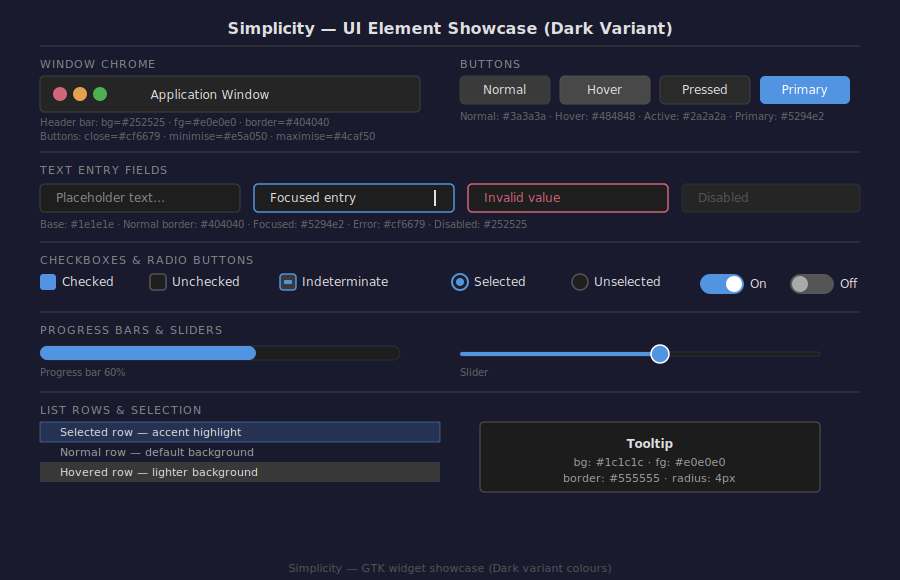

# Theme Elements

This page documents every UI component in the Simplicity theme — what is styled, which GTK CSS classes are targeted, and how each element looks across the three variants.

---

## Window Frame

The window frame is composed of the **header bar** (title bar), optional **toolbar**, and the **window body**.

### Header Bar

The header bar provides the window title, traffic-light buttons (close/minimise/maximise), and any application-specific actions placed in the bar.

| Property | Dark | Light | Dual-Tone |
|----------|------|-------|-----------|
| Background | `#252525` | `#ebebeb` | `#252525` |
| Text colour | `#e0e0e0` | `#2d2d2d` | `#e0e0e0` |
| Bottom border | `#404040` | `#d0d0d0` | `#404040` |
| Min height | 46 px | 46 px | 46 px |

GTK CSS target: `headerbar`, `.titlebar`

### Window Buttons (Traffic Lights)

All three variants use the same macOS-inspired traffic-light colours for visual consistency.

| Button | Colour | Hover colour |
|--------|--------|-------------|
| Close | `#cf6679` | Lighter pink |
| Minimise | `#e5a050` | Lighter orange |
| Maximise | `#4caf50` | Lighter green |

GTK CSS target: `headerbar button.titlebutton`

### Toolbar

The toolbar sits directly below the header bar and holds navigation buttons, location bars, and quick-action buttons.

| Property | Dark | Light | Dual-Tone |
|----------|------|-------|-----------|
| Background | `#2a2a2a` | `#ebebeb` | `#2a2a2a` |
| Border | `#404040` | `#d0d0d0` | `#404040` |

GTK CSS target: `toolbar`

### Window Body

The area below the toolbar and toolbar strip — the main content area of the window.

| Property | Dark | Light | Dual-Tone |
|----------|------|-------|-----------|
| Background | `#2d2d2d` | `#f5f5f5` | `#f5f5f5` |
| Text colour | `#e0e0e0` | `#2d2d2d` | `#2d2d2d` |

GTK CSS target: `window`, `.background`

---

## Sidebar / Navigation Panel

Side panels and navigation drawers use a slightly different shade from the main window body to create visual separation.

| Property | Dark | Light | Dual-Tone |
|----------|------|-------|-----------|
| Background | `#252525` | `#f0f0f0` | `#2a2a2a` |
| Text colour | `#e0e0e0` | `#2d2d2d` | `#e0e0e0` |
| Active item accent bar | `#5294e2` (3 px left) | `#5294e2` | `#5294e2` |
| Selected item highlight | `rgba(#5294e2, 0.25)` | same | same |

GTK CSS target: `.sidebar`, `placessidebar`, `.nautilus-window .sidebar`

---

## Buttons

Buttons adapt to their state and variant. The accent colour (`#5294e2`) is always used for suggested-action (primary) buttons.

### States

| State | Dark BG | Light BG |
|-------|---------|----------|
| Normal | `#3a3a3a` | `#e8e8e8` |
| Hover | `#484848` | `#d8d8d8` |
| Active (pressed) | `#2a2a2a` | `#c8c8c8` |
| Insensitive (disabled) | `#2e2e2e` | `#eeeeee` |
| Suggested action | `#5294e2` | `#5294e2` |
| Destructive action | border `#cf6679` | border `#cf6679` |

### Button text
- Normal: `#e0e0e0` (dark) / `#2d2d2d` (light)
- Disabled: `#666666` (dark) / `#aaaaaa` (light)
- Suggested action: `#ffffff`

GTK CSS target: `button`, `button.suggested-action`, `button.destructive-action`

---

## Text Entry Fields

Input fields (`GtkEntry`, `GtkSearchEntry`, `GtkTextView`) use the base colour and change their border on focus.

| State | Background | Border |
|-------|-----------|--------|
| Normal | `#1e1e1e` (dark) / `#ffffff` (light) | `#404040` / `#d0d0d0` |
| Focused | same | `#5294e2` (1.5 px) |
| Error | same | `#cf6679` (1.5 px) |
| Warning | same | `#e5a050` (1.5 px) |
| Disabled | `#252525` / `#f0f0f0` | `#303030` / `#c0c0c0` |

The text cursor (insertion point) colour matches the foreground: `#e0e0e0` (dark) / `#2d2d2d` (light).

GTK CSS target: `entry`, `textview`, `searchentry`

---

## Checkboxes and Radio Buttons

| State | Indicator background | Border |
|-------|---------------------|--------|
| Unchecked | `#1e1e1e` / `#ffffff` | `#555555` / `#cccccc` |
| Checked | `#5294e2` | none |
| Indeterminate | `#3a3a3a` / `#e8e8e8` | `#5294e2` |
| Disabled | `#252525` / `#f0f0f0` | `#333333` / `#dddddd` |

GTK CSS target: `checkbutton check`, `radiobutton radio`

---

## Toggle Switches

| State | Track colour | Thumb colour |
|-------|-------------|-------------|
| On | `#5294e2` | `#ffffff` |
| Off | `#555555` (dark) / `#cccccc` (light) | `#aaaaaa` / `#ffffff` |

GTK CSS target: `switch`, `switch slider`

---

## Progress Bars

| Element | Colour |
|---------|--------|
| Track (empty) | `#1e1e1e` / `#e0e0e0` |
| Fill (progress) | `#5294e2` |
| Pulse animation fill | `#5294e2` |

GTK CSS target: `progressbar`, `progressbar trough`, `progressbar progress`

---

## Sliders (Scale Widgets)

| Element | Dark | Light |
|---------|------|-------|
| Track fill | `#5294e2` | `#5294e2` |
| Track empty | `#1e1e1e` | `#e0e0e0` |
| Thumb (slider handle) | `#5294e2`, white border | `#5294e2`, white border |

GTK CSS target: `scale trough`, `scale slider`

---

## Scrollbars

Scrollbars use an overlay style that appears only on hover to minimise visual clutter.

| Element | Dark | Light |
|---------|------|-------|
| Track | `#1e1e1e` | `#e0e0e0` |
| Thumb | `#555555` | `#aaaaaa` |
| Thumb hover | `#6a6a6a` | `#888888` |

GTK CSS target: `scrollbar trough`, `scrollbar slider`

---

## Menus and Popovers

Menus are part of the dark chrome in the Dual-Tone variant, and follow the respective background colour in Dark and Light variants.

| Element | Dark / Dual-Tone | Light |
|---------|-----------------|-------|
| Menu background | `#252525` | `#f0f0f0` |
| Menu item text | `#e0e0e0` | `#2d2d2d` |
| Menu item hover | `rgba(#5294e2, 0.25)` | same |
| Menu item selected | `#5294e2` | `#5294e2` |
| Separator | `#404040` | `#d0d0d0` |
| Border | `#404040` | `#d0d0d0` |

GTK CSS target: `menu`, `menuitem`, `popover`

---

## Tooltips

Tooltips always use a near-black background in dark/dual-tone, and a near-white background in the light variant, to remain readable at a glance.

| Property | Dark / Dual-Tone | Light |
|----------|-----------------|-------|
| Background | `#1c1c1c` | `#f0f0f0` |
| Text | `#e0e0e0` | `#2d2d2d` |
| Border | `#555555` | `#d0d0d0` |
| Border radius | 4 px | 4 px |
| Padding | 4 px 8 px | 4 px 8 px |

GTK CSS target: `tooltip`, `window.popup`

---

## List Views and Tree Views

| State | Dark background | Light background |
|-------|----------------|-----------------|
| Default row | `#2d2d2d` | `#ffffff` |
| Alternate row | `#292929` | `#f9f9f9` |
| Hovered row | `#383838` | `#ececec` |
| Selected row | `rgba(#5294e2, 0.2)` + `#5294e2` border | same |
| Selected row (focused) | `#5294e2` fully opaque | same |

GTK CSS target: `treeview`, `listview`, `listbox row`

---

## Tab Bars (`GtkNotebook`)

| Element | Dark | Light |
|---------|------|-------|
| Tab bar background | `#1e1e1e` | `#e8e8e8` |
| Active tab | `#2d2d2d` / `#f5f5f5` | same |
| Active tab border | `#5294e2` (1 px bottom or outline) | same |
| Inactive tab | `#252525` / `#dcdcdc` | same |
| Inactive tab text | `#888888` | `#888888` |

GTK CSS target: `notebook`, `notebook tab`

---

## Status Bars

| Property | Dark | Light |
|----------|------|-------|
| Background | `#1e1e1e` | `#ebebeb` |
| Text | `#888888` | `#888888` |
| Border (top) | `#404040` | `#d0d0d0` |

GTK CSS target: `statusbar`

---

## Window Manager Decorations

### Metacity (GNOME / MATE)

The Metacity theme is defined in `metacity-1/metacity-theme-3.xml`. It provides:
- Titled titlebar with the same dark chrome colours as the GTK header bar
- Matching traffic-light button colours across all variants
- Active and inactive window states — inactive windows dim the title slightly

### XFWM4 (XFCE)

The XFCE window manager theme (`xfwm4/themerc`) uses the same colour tokens:
- `active_color_1` = header background (dark variants: `#252525`; light: `#ebebeb`)
- `inactive_color_1` = dimmed header for unfocused windows
- Button and text colours matching the main palette

### Openbox

The Openbox theme (`openbox-3/themerc`) covers:
- `window.active.title.*` — focused titlebar
- `window.inactive.title.*` — unfocused titlebar
- `menu.*` — Openbox right-click menus
- `osd.*` — on-screen display (workspace switch, volume indicator)
