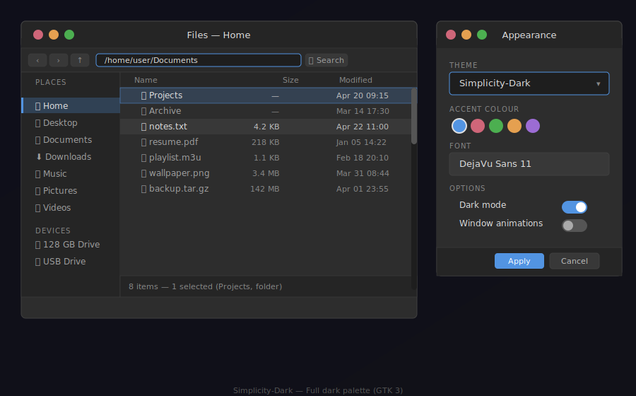
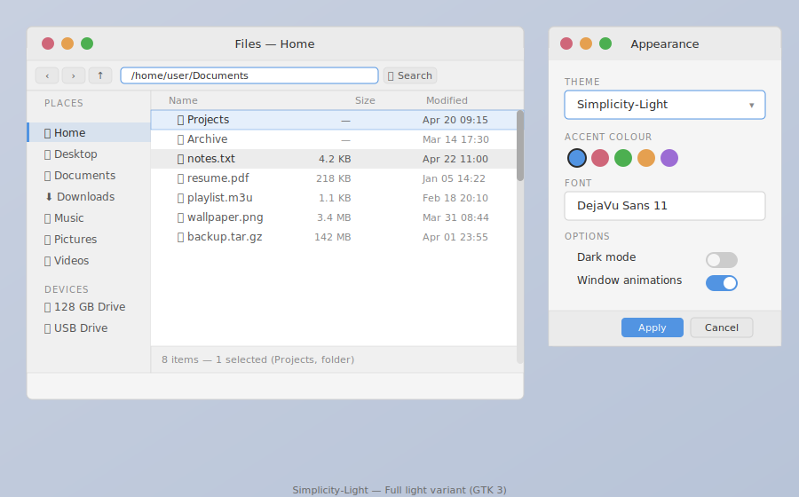

# Theme Variants

Simplicity ships three distinct theme variants. Each is a self-contained set of files covering GTK 2, GTK 3, GTK 4, and all supported window managers.

---

## Simplicity (Dual-Tone) — Default

> **Theme name:** `Simplicity`  
> **Source directory:** `simplicity-dualtone/`

The default variant combines a **dark chrome** with a **light content area**, giving you the visual polish of a dark interface frame alongside the readability of a light document area.


### What's dark
- Header bar (title bar and toolbar)
- Sidebar / navigation panel
- Menus and popovers
- Tooltips
- OSD (on-screen display overlays)

### What's light
- Main window body
- Text entry fields
- Tree views and list views
- Buttons (neutral state)
- Scrolled content areas

### Colour highlights
| Region | Background | Foreground |
|--------|-----------|-----------|
| Header bar | `#252525` | `#e0e0e0` |
| Sidebar | `#2a2a2a` | `#e0e0e0` |
| Content area | `#f5f5f5` | `#2d2d2d` |
| Text entries (base) | `#ffffff` | `#2d2d2d` |
| Accent / selection | `#5294e2` | `#ffffff` |

### When to use
Choose the Dual-Tone variant if you want:
- A distinctive "pro" look with clear visual separation between chrome and content
- Comfortable long-form reading (light background) with low eye-strain from the dark frame
- The appearance most designers associate with applications like VS Code or Spotify

---

## Simplicity-Dark — Full Dark

> **Theme name:** `Simplicity-Dark`  
> **Source directory:** `simplicity-dark/`

The full dark variant applies the dark palette consistently to every surface — header, content area, sidebars, inputs, and widgets.



### Colour palette
| Role | Value |
|------|-------|
| Main background | `#2d2d2d` |
| Dark background (panels) | `#252525` |
| Base (inputs, trees) | `#1e1e1e` |
| Foreground / text | `#e0e0e0` |
| Borders | `#404040` |
| Button background | `#3a3a3a` |
| Button hover | `#484848` |
| Button pressed | `#2a2a2a` |
| Accent / selection | `#5294e2` |
| Tooltip background | `#1c1c1c` |

### When to use
Choose the Dark variant if you:
- Prefer a fully immersive dark environment — no light surfaces anywhere
- Work in low-light conditions for extended periods
- Use applications such as terminals, code editors, or media players where dark-everywhere is preferred

---

## Simplicity-Light — Full Light

> **Theme name:** `Simplicity-Light`  
> **Source directory:** `simplicity-light/`

The full light variant applies a clean light palette consistently across all surfaces.



### Colour palette
| Role | Value |
|------|-------|
| Main background | `#f5f5f5` |
| Header / panel background | `#ebebeb` |
| Base (inputs, trees) | `#ffffff` |
| Foreground / text | `#2d2d2d` |
| Borders | `#d0d0d0` |
| Button background | `#e8e8e8` |
| Button hover | `#d8d8d8` |
| Button pressed | `#c8c8c8` |
| Accent / selection | `#5294e2` |
| Tooltip background | `#f0f0f0` |

### When to use
Choose the Light variant if you:
- Work in bright environments or on high-glare monitors
- Prefer the traditional desktop aesthetic
- Need maximum contrast for accessibility

---

## Side-by-Side Comparison

| Element | Dark | Light | Dual-Tone |
|---------|------|-------|-----------|
| Header bar | `#252525` dark | `#ebebeb` light | `#252525` **dark** |
| Sidebar | `#2a2a2a` dark | `#f0f0f0` light | `#2a2a2a` **dark** |
| Window body | `#2d2d2d` dark | `#f5f5f5` light | `#f5f5f5` **light** |
| Text entries | `#1e1e1e` dark | `#ffffff` light | `#ffffff` **light** |
| Primary text | `#e0e0e0` light | `#2d2d2d` dark | mixed |
| GTK dark-mode flag | `1` (on) | `0` (off) | `0` (off) |

All three variants share the same accent, error, warning, and success colours (`#5294e2`, `#cf6679`, `#e5a050`, `#4caf50`).

---

## Installing Multiple Variants

You can install all variants in a single command:

```bash
./install.sh --dark --light
```

This installs:
- `Simplicity` (dual-tone) → `~/.themes/Simplicity/`
- `Simplicity-Dark` → `~/.themes/Simplicity-Dark/`
- `Simplicity-Light` → `~/.themes/Simplicity-Light/`

To switch between installed variants without reinstalling:

```bash
# Apply the dark variant
./scripts/apply-theme.sh --dark

# Apply the light variant
./scripts/apply-theme.sh --light

# Apply the default dual-tone variant
./scripts/apply-theme.sh
```
